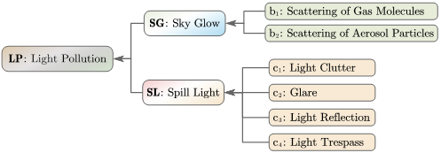

# SG-SL_Model

## Introduction
In order to identify the light pollution risk level of a location, we divide it into two large categories according to the spatial scale, which are Sky Glow (Large spatial scale at ground level) and Spill Light (Moderate spatial scale at urban level). Based on the definition and causes of light pollution, we developed SG-SL Light Pollution Estimation Model Based on Radiometric and GIS Method. 
## Quick Start
### code structure
the code's structure should be as follows:
```text
└─SG-SL_Model
  ├─README.md
  ├─figs
    ├─model_architecture.png
    ├─result.png 
  ├─utils
    ├─dataset.py                      # read data from directory
    ├─hdf2tif.py                      # transform datas from hdf to tif type
    ├─imgtool.py                      # tools that can help the model deal with images
    ├─model.py                        # the boby of our model
    ├─strategy.py                     # the trategy of mitigating light pollution
  ├─main.py                           # main code to run our model
```
### data structure
the datas used should be orgnized to the structure as follows: 
```
└─Datasets
  ├─summer
    ├─aerosol
      ├─ezhou
      ├─jianshi
      ├─shennongjia
      ├─wuhan
    ├─dem
      ├─ezhou
      ├─jianshi
      ├─shennongjia
      ├─wuhan
    ├─gas
      ├─ezhou
      ├─jianshi
      ├─shennongjia
      ├─wuhan
    ├─landuse
      ├─ezhou
      ├─jianshi
      ├─shennongjia
      ├─wuhan
    ├─ndvi
      ├─ezhou
      ├─jianshi
      ├─shennongjia
      ├─wuhan
    ├─nightlight
      ├─ezhou
      ├─jianshi
      ├─shennongjia
      ├─wuhan
    ├─pop
      ├─ezhou
      ├─jianshi
      ├─shennongjia
      ├─wuhan
    ├─road
      ├─ezhou
      ├─jianshi
      ├─shennongjia
      ├─wuhan
  ├─winter
    ├─aerosol
      ├─ezhou
      ├─jianshi
      ├─shennongjia
      ├─wuhan
    ├─dem
      ├─ezhou
      ├─jianshi
      ├─shennongjia
      ├─wuhan
    ├─gas
      ├─ezhou
      ├─jianshi
      ├─shennongjia
      ├─wuhan
    ├─landuse
      ├─ezhou
      ├─jianshi
      ├─shennongjia
      ├─wuhan
    ├─ndvi
      ├─ezhou
      ├─jianshi
      ├─shennongjia
      ├─wuhan
    ├─nightlight
      ├─ezhou
      ├─jianshi
      ├─shennongjia
      ├─wuhan
    ├─pop
      ├─ezhou
      ├─jianshi
      ├─shennongjia
      ├─wuhan
    ├─road
      ├─ezhou
      ├─jianshi
      ├─shennongjia
      ├─wuhan
```
